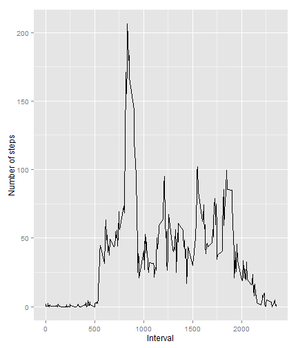

```r
# Load all necessary libraries
library(reshape2)
library(ggplot2)
```

## Loading and preprocessing the data

1. Load the data


```r
df <- read.csv(unzip("repdata-data-activity.zip"))
```

2. Process/transform the data (if necessary) into a format suitable for your analysis

Not necessary for my analysis.

## What is mean total number of steps taken per day?

1. Calculate the total number of steps taken per day


```r
# Data grouped by date
grouped_by_date <- melt(df, id.vars = c("date", "interval"))
grouped_by_date <- dcast(grouped_by_date, date ~ interval)

# Total steps taken per day
grouped_by_date$total_steps <- rowSums(grouped_by_date[-1], na.rm = TRUE)
```

2. If you do not understand the difference between a histogram and a barplot, research the difference between them. Make a histogram of the total number of steps taken each day


```r
g <- ggplot(data = grouped_by_date, aes(x = total_steps)) + 
     geom_histogram(binwidth = 5000)

print(g)
```


3. Calculate and report the mean and median of the total number of steps taken per day


```r
mean(grouped_by_date$total_steps)
```

```
## [1] 9354.23
```

```r
median(grouped_by_date$total_steps)
```

```
## [1] 10395
```

## What is the average daily activity pattern?

1. Make a time series plot (i.e. `type = "l"`) of the 5-minute interval (x-axis) and the average number of steps taken, averaged across all days (y-axis)


```r
# Data grouped by interval
grouped_by_interval <- melt(df, id.vars = c("interval", "date"))
grouped_by_interval <- dcast(grouped_by_interval, interval ~ date)

# Adding a new column with averages
grouped_by_interval$mean <- rowMeans(grouped_by_interval[-1], na.rm = TRUE)

# Plotting using ggplot2
g <- ggplot(grouped_by_interval, aes(x = interval, y = mean)) + 
     geom_line() + 
     xlab("Interval") + 
     ylab("Number of steps")

print(g)
```



2. Which 5-minute interval, on average across all the days in the dataset, contains the maximum number of steps?


```r
grouped_by_interval[which.max(grouped_by_interval$mean), ]$interval
```

```
## [1] 835
```

## Imputing missing values

1. Calculate and report the total number of missing values in the dataset (i.e. the total number of rows with `NA`s)


```r
sum(is.na(grouped_by_date))
```

```
## [1] 2304
```

2. Devise a strategy for filling in all of the missing values in the dataset. The strategy does not need to be sophisticated. For example, you could use the mean/median for that day, or the mean for that 5-minute interval, etc.


```r
# Calculate the mean for each day
grouped_by_date$mean <- rowMeans(grouped_by_date[-1], na.rm = TRUE)
```

3. Create a new dataset that is equal to the original dataset but with the missing data filled in.


```r
# Make a copy of the original dataset
df_without_na <- df

# Fill all the missing values with its corresponding day mean
df_without_na$steps <- ifelse(is.na(df$steps), grouped_by_date[df$date, ]$mean, df$steps)
```

4. Make a histogram of the total number of steps taken each day and Calculate and report the **mean** and **median** total number of steps taken per day. Do these values differ from the estimates from the first part of the assignment? What is the impact of imputing missing data on the estimates of the total daily number of steps?


```r
# Data grouped by date
grouped_by_date <- melt(df_without_na, id.vars = c("date", "interval"))
grouped_by_date <- dcast(grouped_by_date, date ~ interval)

# Total steps taken per day
grouped_by_date$total_steps <- rowSums(grouped_by_date[-1])

# Plotting using ggplot2
g <- ggplot(data = grouped_by_date, aes(x = total_steps)) + geom_histogram(binwidth = 5000)

print(g)
```


```r
mean(grouped_by_date$total_steps)
```

```
## [1] 9354.23
```

```r
median(grouped_by_date$total_steps)
```

```
## [1] 10395
```
- As you can see the values don't differ from the first part.
- As my strategy for filling missing values is use the mean for each day and there are 8 days with all steps equals to NA (mean for that days would be 0 as in the first part) then for me there is no impact on imputing missing data.

## Are there differences in activity patterns between weekdays and weekends?

1. Create a new factor variable in the dataset with two levels - "weekday" and "weekend" indicating whether a given date is a weekday or weekend day.


```r
# Transform dates to Date class
df$date <- as.Date(df$date)

# Define not weekend days
weekdays <- c('Monday', 'Tuesday', 'Wednesday', 'Thursday', 'Friday')

# Get logical vector
is_weekday <- weekdays(df$date) %in% weekdays

# Add the new column
df$day_type <- factor(is_weekday, levels = c(FALSE, TRUE), labels = c('weekend', 'weekday'))
```

2. Make a panel plot containing a time series plot (i.e. `type = "l"`) of the 5-minute interval (x-axis) and the average number of steps taken, averaged across all weekday days or weekend days (y-axis). See the README file in the GitHub repository to see an example of what this plot should look like using simulated data.


```r
# Data grouped by interval and day type
grouped_by_interval_and_day_type <- melt(df, id.vars = c("interval", "date", "day_type"))
grouped_by_interval_and_day_type <- dcast(grouped_by_interval_and_day_type, interval + day_type ~ date)

# Adding new average column
grouped_by_interval_and_day_type$avg <- rowMeans(grouped_by_interval_and_day_type[c(-1, -2)], na.rm = TRUE)

# Plotting using ggplot2
g <- ggplot(grouped_by_interval_and_day_type, aes(x = interval, y = avg)) + 
     facet_wrap(~ day_type, nrow = 2, ncol = 1) + 
     geom_line() + 
     xlab("Interval") + 
     ylab("Number of steps")

print(g)
```


